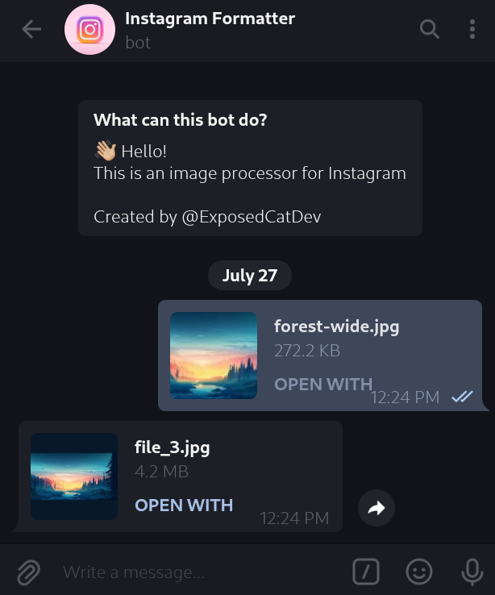

<div align="center">
    <h1>Instagram Posts Formatter<br>Telegram Bot</h1>

<a href="https://t.me/ExposedCatDev">


</a>
<a href="https://www.reddit.com/user/ExposedCatDev">

</a>
<a href="https://app.swaggerhub.com/apis-docs/artem-prokop/insta-formatter-telegram/1.0.0">

</a>



</div>

<div align="center">
    <h2>🤝 Try it out</h2>
</div>
<ul>
    <li><a href="https://t.me/insta_formatter_bot">Telegram Bot</a></li>
    <li><a href="https://github.com/ExposedCat/insta-formatter">Formatting API</a></li>
</ul>

<div align="center">
    <h2>⭐️ Features</h2>
</div>
<ul>
    <li>Portrait, Landscape and Standard posts support</li>
    <li>Using image dominant color as the background for the gaps</li>
    <li>Strict code formatting rules</li>
    <li>Scalable file architecture</li>
    <li>Well-readable git repository with a beautiful README :з</li>
</ul>

<div align="center">
    <h2>💼 TODO</h2>
</div>
<ul>
    <li>Add option to specify custom aspect ratio</a></li>
</ul>

<div align="center">
    <h2>⚙️ Stack</h2>
</div>
<ul>
    <li>Programming language: Node.JS</li>
    <li>API: Telegraf.JS</li>
</ul>

<div align="center">
    <h2>🔌 Running</h2>
</div>

<div align="center">
    <h2>via pure Node.JS</h2>
</div>

1. Clone this repo:

```bash
git clone https://github.com/ExposedCat/insta-formatter-telegram.git
```

2. Go to the project root:

```bash
cd insta-formatter-telegram
```

3. Create copy of `example-config.env` called `config.env` and replace example data with yours
4. Start app:

```bash
npm start
```
or
```bash
node .
```
or
```bash
node src/app.js
```

<div align="center">
    <h2>🔩 Dependencies</h2>
</div>
<ul>
    <li>Telegraf.JS</li>
    <li>Telegraf I18N</li>
    <li>Axios</li>
    <li>DotEnv</li>
</ul>
